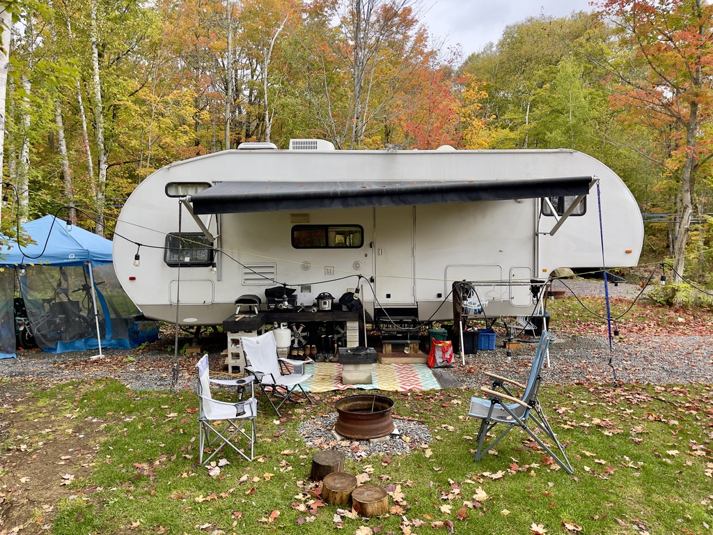
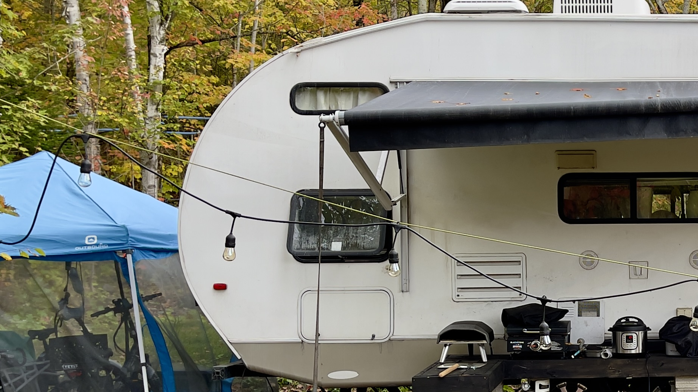
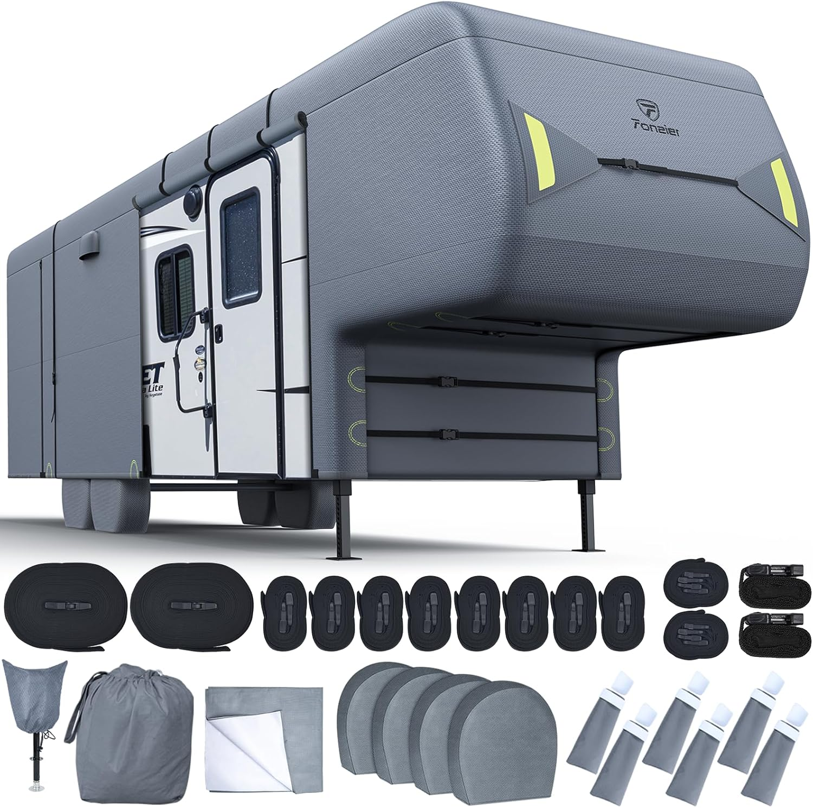

# Custom Covers vs Tarps: What's the Ideal Winter Protection for Your RV in Canada? ## TL;DR

## TL;DR

I'm traveling across Canada and the United States with my family and need to prepare my RV for the Canadian winter. I'm wondering if a custom or semi-custom cover is a better investment than a simple tarp. Covers resist UV, snow, rain, and temperature variations. Their breathable materials and precise fit reduce condensation and mold. Tarps, though economical, are not breathable, difficult to secure, can scratch the RV due to wind, and deteriorate quickly in the elements. I'm also considering using dehumidifiers like DampRid inside to control moisture, knowing that snow can put pressure on a poorly installed tarp.

Custom or semi-custom covers are more expensive, but more durable and offer better protection. I had trouble finding one that fits my RV's curved rear design, but I'm considering two affordable semi-custom options: the ProTECHtor and the Fonzier, both offering good weather protection. I'm also planning to invest in a connected hygrometer to monitor humidity inside the RV, useful in the winter. I'll share my experiences with the cover installation and its performance after its first Canadian winter.

# The Full Details

I'm Benoit Meunier, and this is my wife and son. A year ago, we sold everything and left Montreal to travel. Now, we're exploring Canada and the United States, searching for the perfect place to settle down.

This year, our fifth-wheel trailer (which I'll refer to as an RV) will have to face our Canadian winter. I've noticed that many RV owners prefer custom-fit or universal covers.

But are they that interesting? Or are they just another expensive purchase driven by marketing? I'll find out if these covers outperform the DIY tarp when faced with elements like snow, unpredictable thaws, and the extreme temperature swings here in the north.

## **Should We Cover Our RV?**

The real question is not whether to cover or not. For me, there's no doubt. The roof of our RV is a target for the insidious damage caused by water, exposed to the rigors of winter. Snow melts, refreezes, and then melts again, seeping into the cracks. If you ignore this, don't be surprised. And even with a brand-new RV, do you think the demand during COVID and the labor shortage have improved quality? Nope.

Not covering means having to constantly monitor. We'll have to climb up there every week, inspect the roof for weak spots, shovel the snow, and check the ice. It's not without risk. And the idea of spending our weekends climbing our RV to shovel snow doesn't appeal to us. A cover is starting to become an attractive option. But the real question: is a custom or semi-custom (universal) cover worth the investment, or can a tarp suffice?

If you have an RV shelter or a large garage, congratulations -- stop reading. ;) For the rest of us, let's continue.

## **The Materials**

## **What Are Covers Made Of?**

High-quality custom covers are not just simple tarps. They are designed to withstand different elements: sun, snow, rain, and UV rays.

The **outer layer**, in polypropylene or polyester, is treated to resist ultraviolet rays, protecting against sun, rain, or snow attacks.

Underneath, an **intermediate layer** allows moisture to escape without letting more in.

Finally, the **inner layer** in fleece or polypropylene cushions the surface of our RV, reducing the risk of scratches.

We've noticed that some manufacturers use up to 7 layers of materials.

### **What About Classic Tarps?**

At the other end, we have the polyethylene tarp: a durable, water-resistant plastic sheet. Affordable? Absolutely. Versatile? Yes. But that's about it.

## **The Big Problem with Moisture in Winter.**

Custom covers and tarps repel direct moisture -- rain, snow, hail, etc. But it's not just about keeping the water out, it's about allowing moisture to escape. Even the best cover is not 100% impermeable. It's designed to breathe. The last thing we want is for moisture to be trapped between our RV and the cover, causing problems. Custom covers, with their venting panels and breathable materials, allow air circulation, preventing condensation. Think of them as a raincoat for your RV with vents -- wet on the outside, dry on the inside.

Tarps? Not so much. The materials lack breathability, and we risk trapping moisture and causing mold.

Why not add **[DampRid moisture absorbers](https://amzn.to/4eRwTss)** to be sure? We think so. For a 30-foot RV like ours, we'll place a few: one in the kitchen, one in the bedroom, and maybe one in the slide-out. It's a small preventive measure to keep damp corners dry all winter.

## **Snow is Heavy, Even if the Winters Are ;)**

Snow is a serious problem. Its weight and accumulating force on our roof all winter are critical. In Canada and Quebec where we'll be this year, winter can dump feet of snow in a single night. The robustness of our cover is crucial. Custom or universal covers are designed with reinforced areas and sloped designs for the snow to slide off. They are made to withstand the pressure.

With a tarp, it all depends on us and our installation. If it's done poorly, snow will accumulate in every dip, and if we don't regularly go out to de-snow, the weight can become an issue. The lack of reinforcement means it's more likely to tear under the pressure. When it comes to snow, custom covers are preferable.

## **We'll Monitor the Humidity.**

In winter, a digital hygrometer and thermometer are not a comfort, but essential. Without them, we're navigating without bearings, unaware if the humidity is rising to dangerous levels. For $10, our **[ThermoPro TP49 digital hygrometer](https://amzn.to/3ZYDUDF)**already gives us accurate, easy-to-read measurements, with a battery life of several months. It's reliable, simple, and effective.

### We'll **Upgrade** Anyway.

We'll get a [Govee Hygrometer Thermometer](https://www.amazon.ca/Govee-Hygrometer-Thermometer-Bluetooth-Humidity/dp/B08KG6KZF5/). Is it worth it? Yes, if we want to improve our monitoring. A smart hygrometer acts as a constant sentinel in our RV. It will send us real-time updates to our phone. If the humidity rises due to melting snow, we'll get an instant alert, wherever we are.

These smart models store historical data to monitor trends. It's not just to satisfy our curiosity; we're trying to understand how our RV handles temperature changes in winter. Has the humidity increased after last week's snowfall? This data helps us make decisions about adjusting our ventilation or dehumidification.

I don't want to go out, unzip the cover, come in with my boots, track snow everywhere, and check the humidity in the cold. We have a 24/7 monitor with Wi-Fi nearby. It's our peace of mind.

## **For a Precise Fit?**

Custom covers fit like a tailor-made garment. They wrap around every curve, every angle, and adapt to the air conditioning and ventilation outlets on the roof. A precise fit reduces the opportunities for wind to seep in and lift the cover, which can be annoying and reduce friction.

A tarp cannot hug the unique shape of our RV. It's like covering a car with a blanket -- there will be places where the wind can infiltrate, causing movement. But what concerns us most is that without this tight fit, water can accumulate in the low spots, adding weight and stress to the tarp, which can lead to tears, leaks, or other issues.

### **Does the Friction Scratch Our RV?**

If the covers fit our RV perfectly, without excess fabric for the wind to wreak havoc, it means less movement. Less movement means less friction and fewer scratches.

It's not just a matter of fit. The materials play a key role in this protection. High-quality covers have soft inner linings, cushioning against the abrasive forces of an ordinary tarp. The rough texture of polyethylene tarps is a recipe for scratches, especially with the wind. This constant friction will leave its mark.

With temperature fluctuations, tarps expand and contract, causing misalignment. This invites the wind to more friction and, ultimately, wear on the finish of our RV. It's a slow attack that we won't notice until it's too late.

## **Durability, Cover or Tarp?**

Covers seem to have an edge in terms of durability. The materials are chosen to resist UV, snow, rain, and wind. Many covers are reinforced at known stress points, like the corners or around vents and antennas, where wear could cause premature failure.

In comparison, a polyethylene tarp? It's great for temporary use, but exposed to the elements for too long, it will degrade. UV makes it brittle, wind pulls and weakens it, loose grommets, and that reliable tarp starts to fall apart. Yes, it's cheap upfront, but if I have to replace it every season, it's not a sustainable solution.

And finally, if I need to repair something, it's easier to sew through polyester of the covers than the plastic of the tarps.

## **Is It Easy to Install?**

For a tarp, we'll need ratchet straps, bungee cords, ropes, and patience. Maybe even weights. Securing a tarp on an RV is complicated, and it never works as planned. Plus, for air circulation, we'll have to get creative with foam blocks or spacers to prevent mold buildup.

Compare that to a cover. We pull it over our RV, tighten the adjustable straps (integrated into the cover), and maybe climb a ladder for a quick final adjustment. Everything is included, and it's designed to fit. The installation is quick, smooth, and -- most importantly -- effective.

## **Do I Have Access in Winter?**

I imagine it's the middle of January, and I need to access our RV to check something. With a custom cover, no problem. Many are equipped with strategically placed zippers, allowing us to open certain sections without having to remove the whole thing. We can get in quickly, do what we need to do, and close it back up fast.

Tarps don't offer us this convenience. We'd have to detach several straps, remove weights, and pull part of the tarp just to open the door. It's not impossible, but it's a chore. And in the freezing winter? That task seems ten times more unpleasant.

## **Warranty, Really?**

I don't believe too much in warranties, but custom RV covers often have more comprehensive warranties, as the manufacturers know their products. When a company has confidence in its materials and design, it proves it with a solid warranty. If something goes wrong -- wear or manufacturing defect -- you have a better chance of being covered... if you're willing to make phone calls and be patient.

Good luck getting that assurance with a tarp. Most tarps have limited or no warranties, and when they fail, we'll have to pay out of pocket for a replacement.

## **Our RV Has a Unique Shape. What to Do?**

If your RV doesn't have a standard shape, finding the perfect fit can be a challenge. Fortunately, many companies offer several customization options in addition to adjusting the cover to the specific RV measurements.

This customization comes at a higher cost, but it's worth considering if it's an investment. On the other hand, if we choose the tarp option for our uniquely shaped RV, we'll probably have to cut, adjust, and figure out how to make it work. It's not ideal for protecting our vehicle from the elements.

## **The Cost?**

Let's get to the main issue: the cost. A high-quality custom cover can cost several hundred dollars, depending on the size and complexity of our RV. Everything contributes to the price: the materials, the fit, the additional features like reinforced areas or ventilation systems. But if we think of it as an investment, a good cover could last for years, while a tarp might only last a season or two before needing replacement.

If we go with standard tarps, we save in the short term. But let's consider the long-term costs: frequent replacements, potential damage to our RV, and the time spent each winter properly securing it. With all that, the price difference can be justified.

### **Custom Cover**

- _Price:_ $1,000 - $4,000+
- _Fit:_ Perfect
- _Material Quality:_ Often superior
- _Lifespan:_ Longer
- _Availability:_ Made to order

### Semi-Custom or Universal Cover

- _Price:_ $100 - $800
- _Fit:_ Good to average
- _Material Quality:_ Variable
- _Lifespan:_ Shorter
- _Availability:_ Ready to purchase

## **Our Situation**

We have a unique challenge with our RV. Our RV has a curved rear, unlike the majority of the flat-backed fifth-wheel trailer designs. It's a rare design, but we love it. This curvature improves water flow, reducing the risk of leaks. It's an elegant solution to a known RV problem. It's not done more often because it's too expensive to manufacture.

Let's be specific. We're talking about a **2011 Forest River Cherokee 285B** that's 29'9" long, 8 feet wide, and 13'2" tall.

After scouring the market, I couldn't find a cover for our model. I spent hours on it, but it seems no one thought our RV deserved a custom cover. Frustrating.

Secondly, that curved rear? While excellent for water management, it seriously complicates the search for a semi-custom cover that fits well. We might have something custom-made for a tight and secure fit, especially with those for flat-backed RVs. But custom? Too expensive. We're investing in a good cover, but **not $2,000 more** because of the style of our RV.

After endless research and several hurdles, I've narrowed down my options. Here are the two universal covers we're considering to protect our precious RV:

### [**ProTECHtor Semi-Custom Fifth Wheel Cover by Empire Covers**](https://www.empirecovers.com/details/706-protechtor-5th-wheel-rv-covers/rv5-c)

- UV and water-resistant triple-layer materials?
- Multilayer top, weatherproof? Twice as good.
- Integrated vents to prevent that bulging? Absolutely.
- Adjustable design for a tight, secure fit? That's what we need.

**$297 USD** available here: ](<https://www.empirecovers.com/details/>](https://www.empirecovers.com/details/)