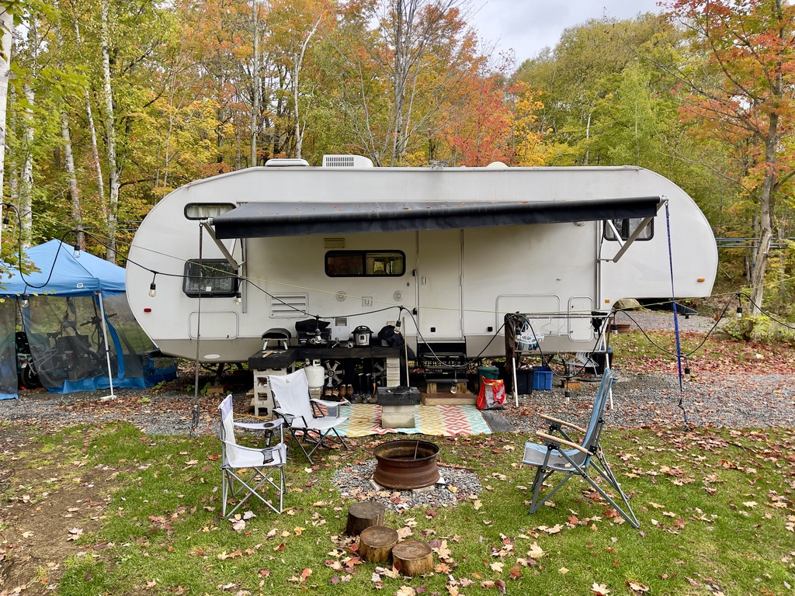
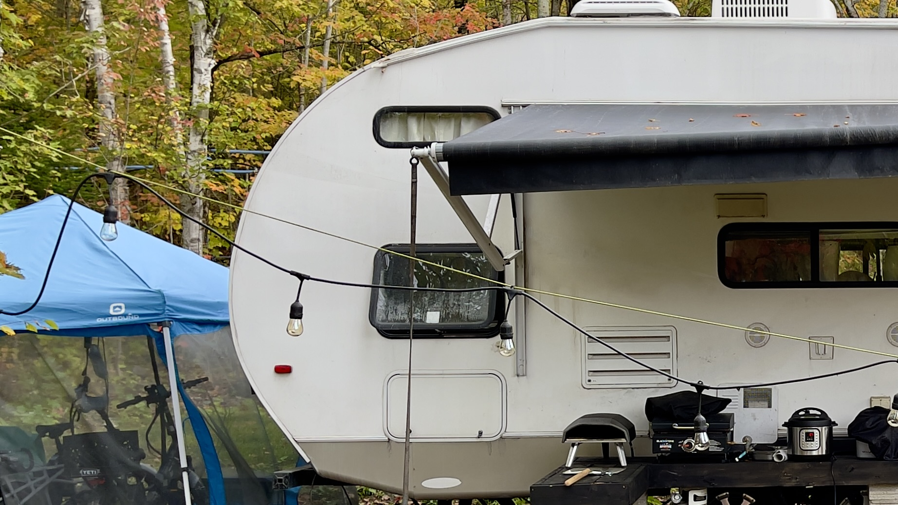
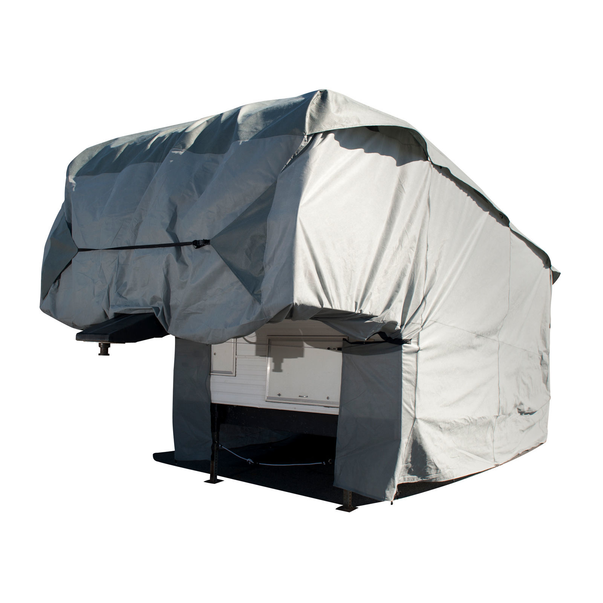
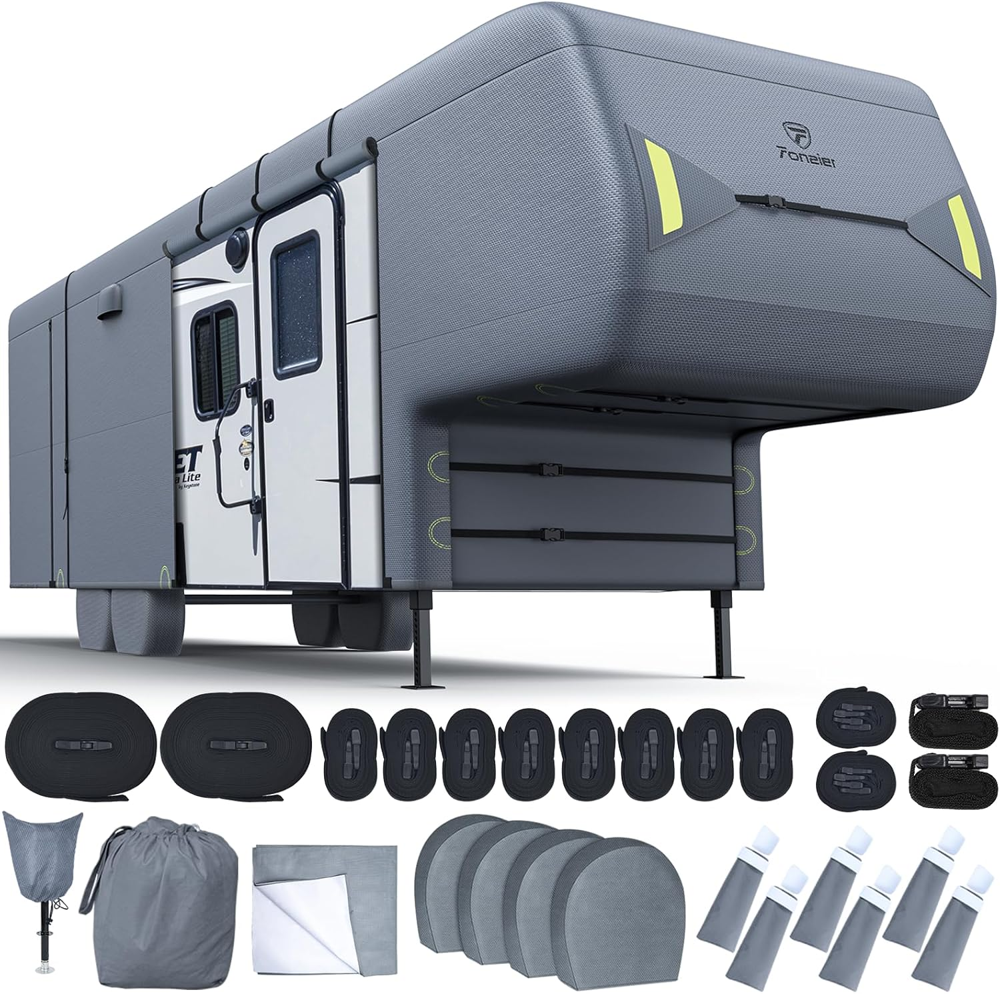

# Housses sur mesure vs bâches : Quelle protection idéale pour votre VR en hiver canadien ?

## TL;DR

_TL;DR est l'acronyme qui se traduit par "**Trop long; pas lu**" en_ français. Le but est de fournir les informations essentielles pour ceux qui n'ont pas le temps ou l'envie de lire le texte en entier._

Je voyage à travers le Canada et les États-Unis avec ma famille et dois préparer mon VR pour l’hiver canadien. Je me demande si une housse sur mesure ou semi-mesure est un meilleur investissement qu’une simple bâche. Les housses résistent aux UV, neige, pluie, et variations de température. Leurs matériaux respirants et ajustement précis réduisentcondensation et moisissures. Les bâches, bien qu’économiques, ne sont pas respirantes, difficiles à attacher, peuvent rayer le VR à cause du vent, et se détériorent vite sous les intempéries. J’envisage aussi d’utiliser des déshumidificateurs comme DampRid à l’intérieur pour contrôler l’humidité, sachant que la neige peut exercer une pression sur une bâche mal installée.

Les housses sur mesure ou semi-mesure sont plus chères, mais plus durables et offrent une meilleure protection. J’ai eu du mal à trouver une adaptée à mon VR à forme arrière courbée, mais j’envisage deux options semi-mesures abordables : la ProTECHtor et la Fonzier, toutes deux offrant une bonne protection contre les intempéries. Je pense aussi investir dans un hygromètre connecté pour surveiller l’humidité à l’intérieur du VR, utile en hiver. Je partagerai mes expériences avec l’installation de la housse et ses performances après son premier hiver canadien.

# L'intégralité en détails

Je suis Benoît Meunier, et voici ma femme et mon fils. Il y a un an, nous avons tout vendu et quitté Montréal pour voyager. Maintenant, nous parcourons le Canada et les États-Unis, à la recherche de l'endroit idéal pour nous installer.

Cette année, notre remorque à sellette (que je nommerai VR) devra affronter notre hiver canadien. J'ai remarqué que denombreux propriétaires de VR préfèrent les housses ajustées sur mesure ou universelles.

Mais sont-elles si intéressantes ? Ou ne sont-elles qu'un autre achat coûteux poussé par du marketing? Je vais découvrir si ces housses surpassent la bâche DIY, face aux éléments comme la neige, les dégels imprévisibles, et les grandes variations de température ici dans le nord.

## **Faut-il couvrir notre RV?**

La vraie question n'est pas de couvrir ou non. Pour moi, cela ne fait aucun doute. Le toit de notre VR est une cible pour les dégâts sournois causés par l'eau, exposé aux rigueurs de l'hiver. La neige fond, regèle, puis refond, s'infiltrant dans les fissures. Si on ignore cela, ne soyez pas surpris. Et même avec un RV neuf, croyez-vous que la demande pendant COVID et la baisse de travailleurs a amélioré la qualité? Nope. 🙂‍↔️

Ne pas couvrir signifie devoir surveiller constamment. Nous devrons monter là-haut toutes les semaines, inspecter le toit pour détecter les points faibles, déblayer la neige et contrôler la glace. Ce n'est pas sans risque. Et l'idée de passer nos fins de semaine à escalader notre VR pour déblayer de la neige ne nous plaît pas. Une housse commence à devenir une option séduisante. Mais la vraie question : une housse sur mesure ou semi-mesure (universelle) vaut-elle l'investissement, ou une bâche peut-elle suffire ?

Si vous avez un abri pour VR ou un grand garage, félicitations -- arrêtez de lire. ;) Pour les autres, continuons.

## **Les matériaux**

## **De quoi sont faites les housses?**

Les housses sur mesure de haute qualité ne sont pas de simples bâches. Elles sont conçues pour affronter différents éléments : soleil, neige, pluie, et rayons UV.

La **couche extérieure**, en polypropylène ou polyester, est traitée pour résister aux rayons ultraviolets, protégeant desattaques du soleil, de la pluie ou de la neige.

En dessous, une **couche intermédiaire** permet à l'humidité s'échapper sans en laisser entrer davantage.

Enfin, la **couche intérieure** en molleton ou polypropylène amortit la surface de notre VR, réduisant le risque de rayures.

Nous avons remarqué que plusieurs fabricants utilisent jusqu'à 7 couches de matériaux.

### **Qu'en est-il des bâches classiques ?**

À l'autre extrémité, nous avons la bâche en polyéthylène : une feuille de plastique durable et résistante à l'eau. Abordable ? Absolument. Polyvalente ? Oui. Mais c'est tout. 

## **Le gros problème de l'humidité en hiver.**

Les housses sur mesure et les bâches repoussent l'humidité directe -- pluie, neige, grêle, etc. Mais il ne s'agit pas seulement de garder l'eau dehors, mais de laisser l'humidité s'échapper. Même la meilleure housse n'est pas 100 % imperméable. Elle est conçue pour respirer. La dernière chose que nous voulons, c'est que l'humidité soit piégée entre notre VR et la housse, causant des problèmes. Les housses sur mesure, avec leurs panneaux d'aération et leurs matériaux respirants, permettent la circulation de l'air, évitant la condensation. Pensez à elles comme à un manteau de pluie pour VR avec des aérations -- humide à l'extérieur, sec à l'intérieur.

Les bâches ? Pas vraiment. Les matériaux manquent de respirabilité, et nous risquerions de piéger de l'humidité et de provoquer des moisissures.

Pourquoi ne pas ajouter **des ****absorbeurs d'humidité DampRid**  (https://amzn.to/4eRwTss)pour être sûr ? On pense que oui. Pour un VR de 30 pieds comme le nôtre, nous en placerons quelques-uns : un dans la cuisine, un dans la chambre, et peut-être un dans la rallonge. C'est une petite mesure préventive pour garder les coins humides secs tout l'hiver.

## **La neige, c'est lourd, même si les hivers ;)**

La neige est un problème sérieux. Son poids et sa force accumulée sur notre toit tout l'hiver sont critiques. Au Canada et au Québec où nous serons cette année, l'hiver peut déposer des pieds de neige en une nuit. La robustesse de notre housse est cruciale. Les housses sur mesure ou universelles sont conçues avec des zones renforcées et des conceptions inclinées pour que la neige glisse. Elles sont faites pour résister sous pression.

Avec une bâche, tout dépend de nous et notre installation. Si elle est mal faite, la neige s'accumulera dans chaque creux, et si nous ne sortons pas régulièrement pour la déneiger, le poids peut devenir un problème. Le manque de renforcement signifie qu'elle est plus susceptible de se déchirer sous la pression. Face à la neige, les housses sur mesure sont préférables.

## **On va surveiller l'humidité.**

En hiver, un hygromètre et un thermomètre numériques ne sont pas un confort, mais essentiel. Sans cela, nous naviguons sans repères, sans savoir si l'humidité monte à des niveaux dangereux. Pour 10$, notre **hygromètre numérique ThermoPro TP49** (https://amzn.to/3ZYDUDF) donne déjà actuellement des mesures précises, faciles à lire, avec une batterie de plusieurs mois. C'est fiable, simple, et efficace.

### On va s'_upgrader_ pareil.

On va acheter un Hygromètre Thermomètre Govee (https://www.amazon.ca/Govee-Hygrometer-Thermometer-Bluetooth-Humidity/dp/B08KG6KZF5/). Ça vaut le coup? Oui, si on veut améliorer notre surveillance. Un hygromètre intelligent agit comme une sentinelle constante dans notre VR. Il nous enverra des mises à jour en temps réel sur notre téléphone. Si l'humidité monte à cause de la neige qui a fondue, on recevra une alerte instantanée, où que nous soyons.

Ces modèles intelligents stockent des données historiques pour surveiller les tendances. Ce n'est pas juste pour satisfaire notre curiosité ; nous essayons de comprendre comment notre VR gère les changements de température en hiver. L'humidité a-t-elle augmenté après la chute de neige de la semaine dernière? Ces données nous aident à prendre des décisions sur l'ajustement de notre ventilation ou de notre déshumidification.

Je ne veux pas sortir, dézipper la housse, entrer avec mes bottes, mettre de la neige partout et vérifier l'humidité dans le froid. Nous avons un moniteur 24/7 avec un Wi-Fi pas loin. C'est notre sérénité.

## **Pour un ajustement précis?**

Les housses sur mesure s'ajustent comme un vêtement taillé sur mesure. Elles enveloppent chaque courbe, chaque angle et s'adaptent aux sorties de l'air climatisé et de ventilation sur le toit. Un ajustement précis réduit les opportunités pour le vent de s'infiltrer et soulever la housse, ce qui peut être ennuyeux et réduire les frottements.

Une bâche ne peut pas épouser la forme unique de notre VR. C'est comme couvrir une voiture avec une couverture -- il y aura des endroits où le vent s'infiltrera, provoquant des mouvements. Mais ce qui nous inquiète surtout c'est qu sans cet ajustement serré, l'eau peut s'accumuler dans les zones basses, ajoutant du poids et du stress à la bâche, ce qui peut entraîner des déchirures, des fuites, ou d'autres problèmes.

### **La friction a-t-elle rayé notre VR ?**

Si les housses s'ajustent parfaitement à notre VR, sans excès de tissu pour que le vent puisse faire des ravages, cela signifie moins de mouvement. Moins de mouvement signifie moins de friction et moins de rayures.

Ce n'est pas qu'une question d'ajustement. Les matériaux jouent un rôle clé dans cette protection. Les housses de haute qualité ont des doublures intérieures douces, amortissant contre les forces abrasives d'une bâche ordinaire. La texture rugueuse des bâches en polyéthylène est une recette pour les rayures, surtout avec le vent. Cette friction constante laissera sa marque.

Avec les fluctuations de température, les bâches se dilatent et se contractent, provoquant un désajustement. Cela invitele vent à plus de frottements et, finalement, d'usure sur la finition de notre VR. C'est une attaque lente que nous ne remarquerons qu'une fois trop tard.

## **Durabilité, housse ou bâche?**

Les housses semblent avoir une avance en matière de durabilité. Les matériaux sont choisis pour résister aux UV, à la neige, à la pluie et au vent. Plusieurs housses sont renforcées dans les points de stress connus, comme les coins ou autour des évents et des antennes, où l'usure pourrait causer une défaillance prématurée.

En comparaison, une bâche en polyéthylène ? C'est super pour un usage temporaire, mais exposée aux éléments troplongtemps, elle se dégradera. Les UV la rendent cassante, le vent l'étire et l'affaiblit, les anneaux lâches et cette bâche fiable commence à se désagréger. Oui, c'est bon marché au départ, mais si je dois la remplacer chaque saison, ce n'est pas une solution durable.

Et finalement, si je dois réparer quelque chose, c'est plus facile que de passer une aiguille à travers du polyester des housses que le plastique en polyéthylène.

## **Est-ce facile à installer?**

Pour une bâche, nous aurons besoin de sangles à cliquet, de cordons élastiques, de cordes, et de patience. Voir même des poids. Attacher une bâche sur un VR, c'est compliqué, et ça ne marche jamais comme prévu. De plus, pour une circulation d'air, il faudra être créatif avec des blocs de mousse ou des entretoises pour éviter l'accumulation de moisissures.

Comparons cela à une housse. Nous la tirons sur notre VR, serrons les sangles réglables (intégrées dans la housse), et peut-être grimpons sur une échelle pour un ajustement rapide. Tout est inclus, et elle est conçue pour s'ajuster. L'installation est rapide, fluide, et -- surtout -- efficace.

## **Est-ce que j'ai accès en hiver?**

Je m'imagine en plein milieu de janvier, et j'ai besoin d'accéder à notre VR pour vérifier quelque chose. Avec une housse sur mesure, aucun problème. Beaucoup sont équipées de fermetures éclair stratégiquement placées, nous permettant d'ouvrir certaines sections sans avoir à tout enlever. Nous pouvons entrer rapidement, faire ce que nous avons à faire, et refermer le tout rapidement.

Les bâches ne nous offrent pas cette commodité. On devrait détacher plusieurs sangles, retirer des poids, et tirer une partie de la bâche juste pour ouvrir la porte. Ce n'est pas impossible, mais c'est une corvée. Et en plein hiver glacial ? Cette tâche semble dix fois plus pénible.

## **Garantie, vraiment?**

Je ne crois pas trop aux garanties, mais les housses sur mesure pour VR ont souvent des garanties plus complètes, car les fabricants connaissent leurs produits. Lorsqu'une entreprise a confiance en ses matériaux et en son design, elle le prouve avec une solide garantie. Si quelque chose tourne mal -- usure ou défaut de fabrication -- vous avez plus de chances d'être couverts ... si on est prêt à envoyer des photos et à patienter au téléphone.

Bonne chance pour obtenir cette assurance avec une bâche. La plupart des bâches ont des garanties limitées, voire aucune, et lorsqu'elles échouent, nous devrons payer de notre poche pour un remplacement.

## **Notre VR a une forme unique. Que faire?**

Si votre VR n'a pas une forme standard, trouver l'ajustement parfait peut être un défi. Heureusement, de nombreuses entreprises offrent plusieurs options de personnalisation en plus d'ajuster la housse selon les mesures spécifiques du VR.

Cette personnalisation a un coût plus élevé, mais il faut voir si cela en vaut l'investissement. D'un autre côté, si notre VR a une taille inhabituelle et qu'on choisit l'option bâche, on devra probablement couper, ajuster, et trouver comment faire en sorte que ça fonctionne. Ce n'est pas idéal pour protéger notre véhicule des éléments.

## **Le coût?**

Passons au problème principal : le coût. Une housse sur mesure de qualité supérieure peut coûter plusieurs centaines de dollars, selon la taille et la complexité de notre VR. Tout cela contribue au prix : les matériaux, l'ajustement, les fonctionnalités supplémentaires comme les zones renforcées ou les systèmes de ventilation. Mais si on y pense comme un investissement, une bonne housse pourrait durer des années, alors qu'une bâche pourrait ne durer qu'une saison ou deux avant de devoir être remplacée.

Si nous choisissons les bâches standard, nous économisons à court terme. Mais réfléchissons aux coûts à long terme : remplacements fréquents, dommages potentiels à notre VR, et le temps passé chaque hiver à bien l'attacher. Avec tout cela, la différence de prix peut se justifier.

### **Housse sur mesure**

- _Prix :_ 1 000 à 4 000 $+
- _Ajustement :_ Parfait
- _Qualité des matériaux :_ Souvent supérieure
- _Durée de vie :_ Plus longue
- _Disponibilité :_ Sur commande

### Housse semi-mesure ou universelle

- _Prix :_ 100 à 800 $
- _Ajustement :_ Bon à moyen
- _Qualité des matériaux :_ Variable
- _Durée de vie :_ Plus courte
- _Disponibilité :_ Prête à acheter

## **Notre Situation**

Nous avons un défi unique avec notre RV. Notre RV a un arrière courbé, contrairement à la majorité des conceptions arrière plates des roulottes à sellettes. C'est un design rare, mais on l'adore. Cette courbure améliore l'écoulement de l'eau, réduisant le risque de fuites. C'est une solution élégante à un problème connu des VR. Il s'en fait plus, car cela coûte trop cher à fabriquer. 😜

Soyons spécifiques. Nous parlons d'un **Forest River Cherokee 2011 285B** de 29'9", 8 pieds de large, et 13'2" de haut.

Après avoir fouillé le marché, je n'ai trouvé aucune housse pour notre modèle. J'y ai passé des heures, mais il semble que personne n'ait pensé que notre VR méritait une housse sur mesure. Frustrant.

Deuxièmement, cet arrière courbé ? S'il est excellent pour la gestion de l'eau, il complique sérieusement la recherche d'une housse semi-mesure qui s'ajuste bien. On aurait peut-être quelque chose de sur mesure pour un ajustement serré et sécurisé, surtout avec celles pour des VR à dos plat. Mais sur mesure ?Trop cher. On investit dans une bonne housse, mais **pas 2 000 $ de plus** à cause du style de notre VR.

Après d'interminables recherches et plusieurs obstacles, j'ai réduit mes options. Voici les deux housses universelles que nous envisageons pour protéger notre précieux VR :

### **Housse Semi-Mesure ProTECHtor pour Fifth Wheel de Empire Covers** (https://www.empirecovers.com/details/706-protechtor-5th-wheel-rv-covers/rv5-c)

- Matériaux à triple couche résistants aux UV et à l'eau ?
- Dessus multicouche, résistant aux intempéries ? Deux fois mieux.
- Aérations intégrées pour éviter ce gonflement ? Absolument.
- Design ajustable pour un ajustement serré et sécurisé ? C'est ce qu'il nous faut.

**297$ USD** disponible ici : https://www.empirecovers.com/details/706-protechtor-5th-wheel-rv-covers/rv5-c

### **Housse Semi-Mesure Fonzier pour Fifth Wheel Améliorée avec 6 Couches, Résistante et Robuste disponible sur Amazon** (https://amzn.to/3TXqrbz)

- Protection UV à 6 couches, anti-déchirure, respirante et réduisant les dommages.
- 4 housses de pneus incluses, bonne idée car nous n’en avions pas.
- 6 protections de gouttières pour prévenir les fuites et obstructions. Pas fou.

**297 $ USD** disponible ici : https://amzn.to/3TXqrbz

Voici d'autres produits qui ont retenu notre attention, mais qui ne correspondaient pas tout à fait à nos critères :

• La **Housse pour Fifth Wheel Gris Facile à Installer de Leader Accessories** (https://www.leaderaccessories.com/collections/5th-wheel-rv-covers/products/5th-wheel-cover-gray-new-easy-setup?variant=31150258815056)](https://www.leaderaccessories.com/collections/5th-wheel-rv-covers/products/5th-wheel-cover-gray-new-easy-setup?variant=31150258815056\) est une option solide à 269 $ USD, mais la taille dont nous avons besoin (29'-33') est en rupture de stock.

• La **housse pour Fifth Wheel** d'Outdoor Cover Warehouse (https://www.outdoorcoverwarehouse.com/rv-covers/ws/expedition-rv-covers/Fifth--Wheel--Trailer/29.html) nous a tapé dans l'œil, mais à 600 $USD, c'est cher.

• La **Silver Shield 3L** (https://www.carcover.ca/silver-shield-3l-rv-cover-for-fifth-wheel-trailer-26-to-29-feet-long.html) de CarCover.ca -- La livraison gratuite est un bon point, mais à 420$ CAD, cela nous fait réfléchir.

### Autres produits

Ce que nous avons
- **ThermoPro TP49 Hygromètre numérique** (https://amzn.to/3ZYDUDF) : Moniteur de température et d'humidité, simple, peu cher, très résistant. Disponible sur Amazon https://amzn.to/3ZYDUDF

Ce que nous envisageons d'ajouter à notre installation :
- **Hygromètre Thermomètre Bluetooth Govee** (https://amzn.to/4dEHdTz) : Grand écran LCD facile à lire, suit les températures et l'humidité max/min, avec stockage de données de 2 ans -- parfait pour surveiller le climat à l'intérieur du VR. Disponible sur Amazon https://amzn.to/4dEHdTz (https://amzn.to/4dEHdTz).).
- **DampRid FG100** (https://amzn.to/4eRwTss) est un absorbeur d'humidité jetable non parfumé de 10,5 onces. Il est simple et efficace pour contrôler l'humidité. Disponible sur Amazon https://amzn.to/4eRwTss (https://amzn.to/4eRwTss).).

## **Prochaines étapes**

Quelles sont les prochaines étapes ? D'abord, nous prendrons une décision finale bientôt, passerons la commande et partagerons les détails. Ensuite, l'installation : mettre la housse en place, s'assurer qu'elle est bien ajustée, et évaluer la facilité du processus.

Une fois la housse installée et qu'elle protègera le VR pendant son premier hiver canadien, nous vous ferons part de nos conclusions. Nous détaillerons ce qui a fonctionné, ce qui n'a pas marché et les éventuels défis inattendus. Que la housse tienne le coup ou qu'elle présente de nouvelles difficultés, nous documenterons tout pour vous fournir un compte-rendu honnête après sa première année.

## **Restez informé.**

Si vous avez des idées, suggestions ou réflexions, contactez-nous par courriel à **ecrire@benoitmeunier.info** (ecrire@benoitmeunier.info).
