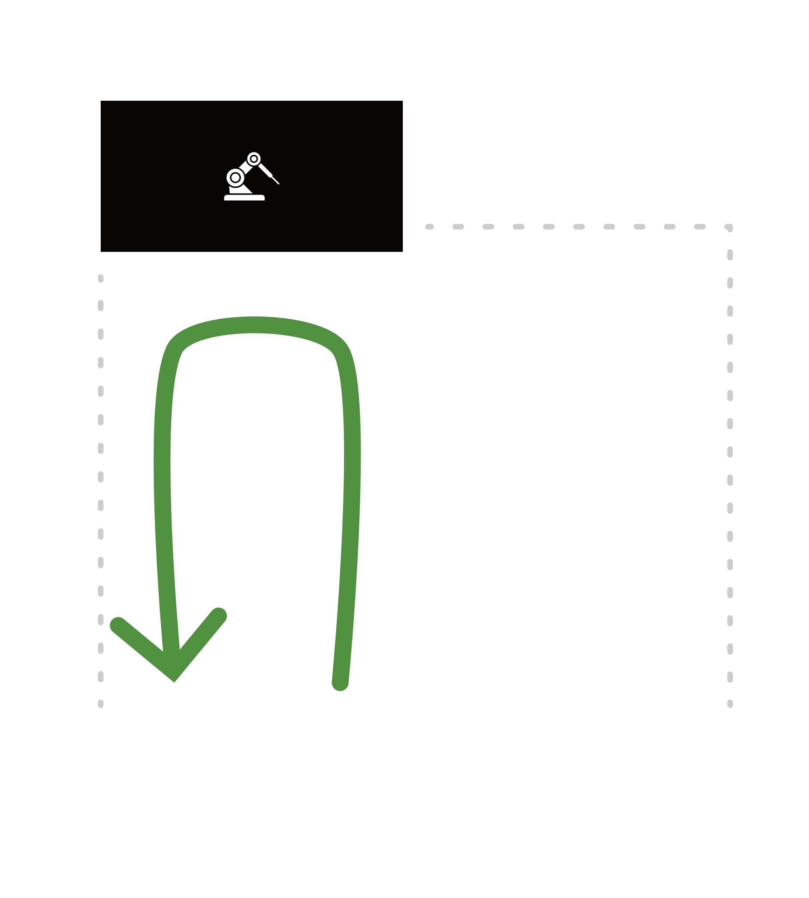
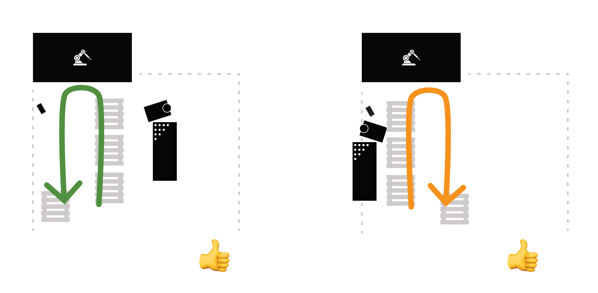
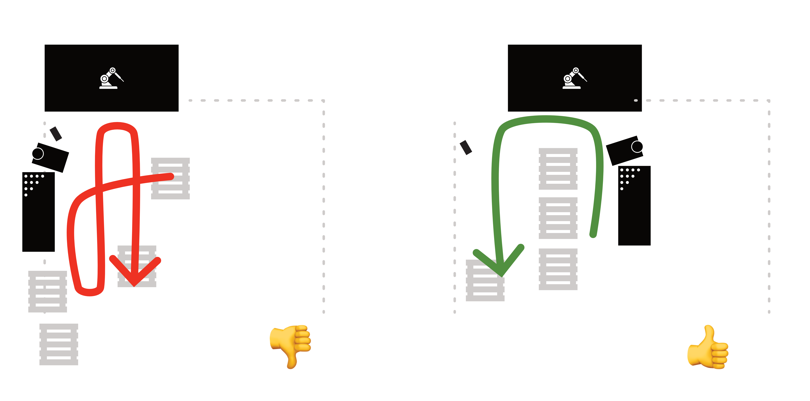

# Optimizing Robotic Welding Operations with a Flexible U-Layout Work Cell

This article shares my insights on optimizing robotic welding operations through the use of a flexible U-layout work cell. The recommendations are based on research and hands-on experience observing automation and welding production at scale.

The goal is to provide a starting point for discussion and improvements that can enhance the productivity of robotic welding operations in a variety of manufacturing settings.

## U-Layout Optimal & Flexible

The U-layout is a work cell design that arranges stations in a U-shape, allowing smooth part movement. Parts enter at one end, go through pre-processing, robotic welding, and post-processing, and exit at the other end.

The loading and unloading areas are at the U's open ends. Key tools like welding tables and welding machines are inside or near the U-shape, allowing parts to flow naturally.

The U-layout helps operators follow a standard design, which they can adapt for efficiency without extra guidance or checking documents.

## U-Layout with No Pre- or Post-Processing

Layouts that prioritize streamlined operations position the welding table and machine to avoid disrupting the main flow of parts, maximizing productivity. Handling defects are kept outside the U-shaped work area, ensuring uninterrupted operations. The overall layout minimizes backtracking and congestion.

The layout follows a logical flow, with a clear path for parts to enter, be processed, and exit efficiently. Placing finished parts on the left side keeps them closer to the department's exit, reducing unnecessary movement.

Defect-handling tasks are outside the main work zone. By placing the welding table and machine outside the core area, more space is freed up for operations. This is ideal, ensuring uninterrupted operations within the U-shaped work area.

## U-Layout with Pre-Processing

### 👎 BAD • Welding Table/Machine on the Left Side

When the welding table/machine are on the left side of the U-shaped workspace, it can lead to scattered pallets, reduced loading space, and operators needing to work around the equipment, slowing down loading efficiency.

Frequent movement of parts between pallets and tables causes unnecessary travel and delays. Interference from loading, unloading, pre-processing in the same workspace leads to bottlenecks and obstructions.

### 👍 BETTER • Welding Table/Machine Outside the U-Shape

Positioning the welding machine/table at the start of the U-shaped layout avoids disrupting the material flow. Parts move smoothly within the U-shape without interference from pre-processing tasks. Operators can focus on feeding the robot or pre-processing without overlapping movements.

Better loading and unloading provide ample space for quicker turnover. With separate pre-processing tasks, unloading and moving finished parts in the U-shape become straightforward, with no clutter obstructing the exit.

The dedicated rework-fixing zone is at the far right of the U-shaped work cell, allowing necessary rework without interfering with the current flow.

## U-Layout with Post-Processing

### 👎 BAD • Welding Table/Machine on the Left Side

Placing the welding machine/table on the left side of the U-shaped workspace can create excessive movement, disorganized material flow, and disruptions to the workflow. Operators must backtrack, causing bottlenecks during rework, and mixing finished and unfinished parts increases the risk of errors and slow-downs.

### 👍 BETTER • Welding Table/Machine Within the U-Shape Flow

Positioning the welding machine/table on the right side of the U-shaped layout, with corresponding pallets nearby, provides a direct path for efficient part movement. Operators can easily unload finished parts and transition directly to post-processing with minimal steps, enabling a smooth, uninterrupted progression of parts through the work cell.

Rework is done at the right place, close to the final stage, without interfering with loading the robot. This keeps the workspace organized and safe.

## U-Layout with Pre- and Post-Processing

Integrating both pre-processing and post-processing tasks in a U-layout is the most challenging configuration to optimize, as it requires coordinating multiple steps before and after the robotic welding operation.

### 👎 BAD • Welding Table/Machine Poorly Positioned

When the welding machine/table are on the left (or right) of the U-Layout, operators must constantly carry parts between scattered pallets, navigating a non-direct path. This increases time, effort, and confusion as they handle pre-processed parts, unload finished parts, and transfer parts to and from the robot.

### 👍 BETTER • Welding Table/Machine Inside the U-Layout

Positioning the welding table/machine at the center of the U-shaped layout allows it to serve both the welding and pallet processing areas. This enables operators to have quick access during both pre-processing and post-processing stages, reducing the time spent moving parts and leading to faster turnaround times with minimal disruptions.

Operators can move to one side for pre-processing tasks and the other side for post-processing tasks, accessing the welding area without interfering with material flows or blocking the loading/unloading stations.

## Recommendations

### Integrated Welding Table with Mobility Solution

An integrated, mobile welding solution can address challenges of a separate welding table and cart. By mounting the welding table and machine onto one wheeled base, manufacturers can eliminate the need for a forklift, facilitate easier movement of the entire setup in the U-Layout, and have a self-contained, mobile welding station to improve productivity.

### Embedding the U-Layout in Operator Workflow Through Visual Cues

Marking the floor with arrows, zones, or labels is a simple but effective way to guide operators when repositioning pallets and welding machine/table in the U-layout, helping to embed the workflow in their daily operations.